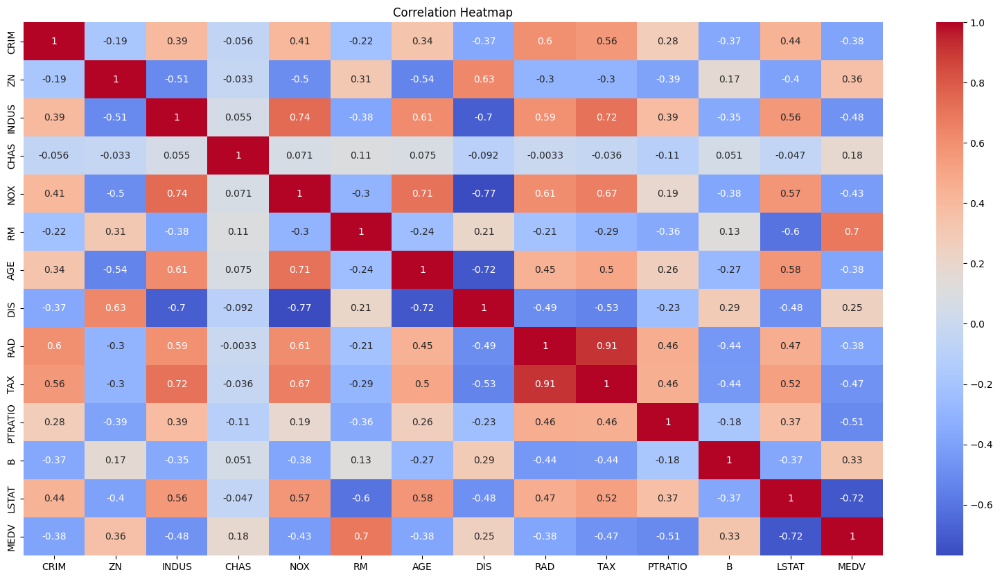
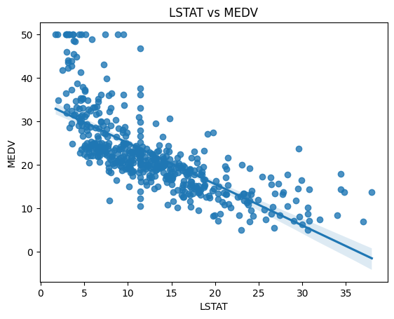
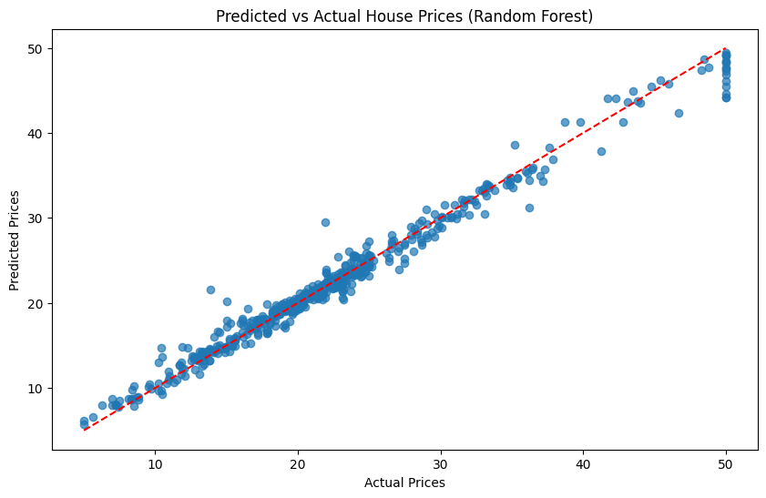
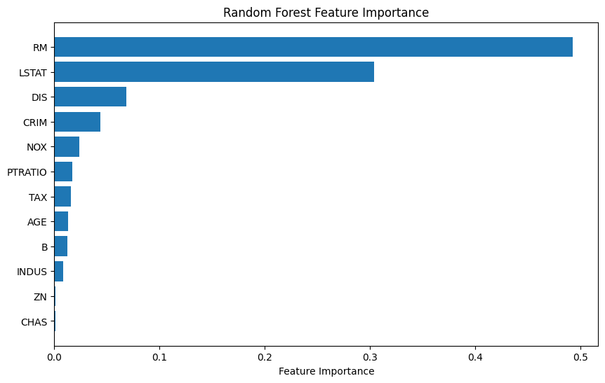

# Boston Housing Price Prediction

## 📌 Overview
This project predicts house prices in Boston using machine learning models.  
It includes data cleaning, exploratory data analysis (EDA), feature scaling, model training, evaluation, and visualization.

## 📊 Dataset
- Source: Boston Housing dataset (loaded from Google Drive in Colab).
- 506 rows, 14 features including crime rate, average rooms per dwelling, property tax rate, etc.
- Target variable: `MEDV` (Median value of owner-occupied homes).

## ⚙️ Workflow
1. **Data Cleaning**  
   - Handle missing values with median imputation.  
   - Convert columns to numeric.  

2. **EDA**  
   - Statistical summary.  
   - Correlation heatmap.  
   - Key relationships (e.g., RM vs MEDV, LSTAT vs MEDV).  

3. **Feature Scaling**  
   - Standardization applied to selected features.  

4. **Model Training & Evaluation**  
   Models compared:
   - Linear Regression  
   - Decision Tree  
   - Random Forest  
   - Extra Trees  
   - Gradient Boosting  
   - XGBoost  

   | Model              | MSE   | R²   | CV Score |
   |--------------------|-------|------|----------|
   | Linear Regression  | 23.84 | 0.66 | 35.86    |
   | Decision Tree      | 24.81 | 0.65 | 43.07    |
   | Random Forest      | 9.89  | 0.86 | 22.20    |
   | Extra Trees        | 12.25 | 0.83 | 19.53    |
   | Gradient Boosting  | 8.32  | 0.88 | 19.75    |
   | XGBoost            | 8.87  | 0.87 | 25.38    |

   ✅ **Best model: Gradient Boosting (MSE: 8.32, R²: 0.88)**

## 📊 Visualizations

### Correlation Heatmap

### LSTAT vs MEDV and RM vs MEDV

### Predicted vs Actual (Random Forest)

### Feature Importance (Random Forest)

     
## 📈 Results
   - Gradient Boosting achieved the best performance.
   - Random Forest also performed strongly with clear feature importance insights.

          
## 🛠️ Requirements
   - Python 3.x
   - Libraries: pandas, numpy, matplotlib, seaborn, scikit-learn, xgboost
     
## 📂 Repository Structure

ShadowFox--Projects/
└── shadowfax/
    ├── BostonHousePricePrediction.ipynb   # Main notebook
    ├── README.md                          # Documentation
    ├── correlation_heatmap.png            # Visualization
    ├── lstat_vs_medv.png                  # Visualization
    ├── rm_vs_medv.png                     # Visualization
    ├── predicted_vs_actual.png            # Visualization
    └── feature_importance.png             # Visualization

